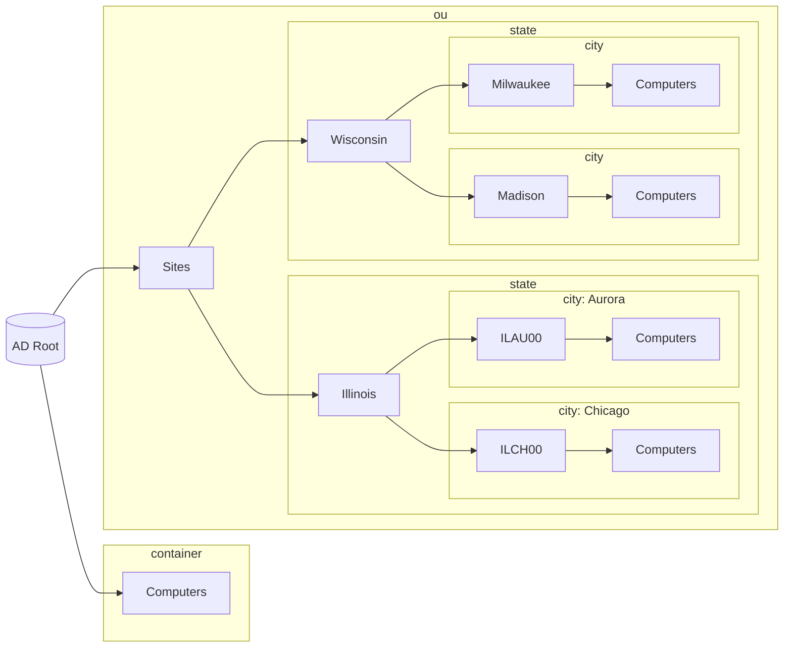

# About

[This script](Move-ComputersByStateSiteCode.ps1) can organize newly created AD computer objects into specific OU's based on state abbrevations.

### Assumptions

Assumes the following of an AD infrastructure:
1. All newly created AD computer objects:
    1. are automatically placed in the default "Computers" container.
    2. need to be moved to a custom "Sites" OU.
    3. have a 6-character naming prefix, which starts with the two letter US state abbreviation
2. "Sites" is a root OU and uses the following example heirarchy:
    - 

