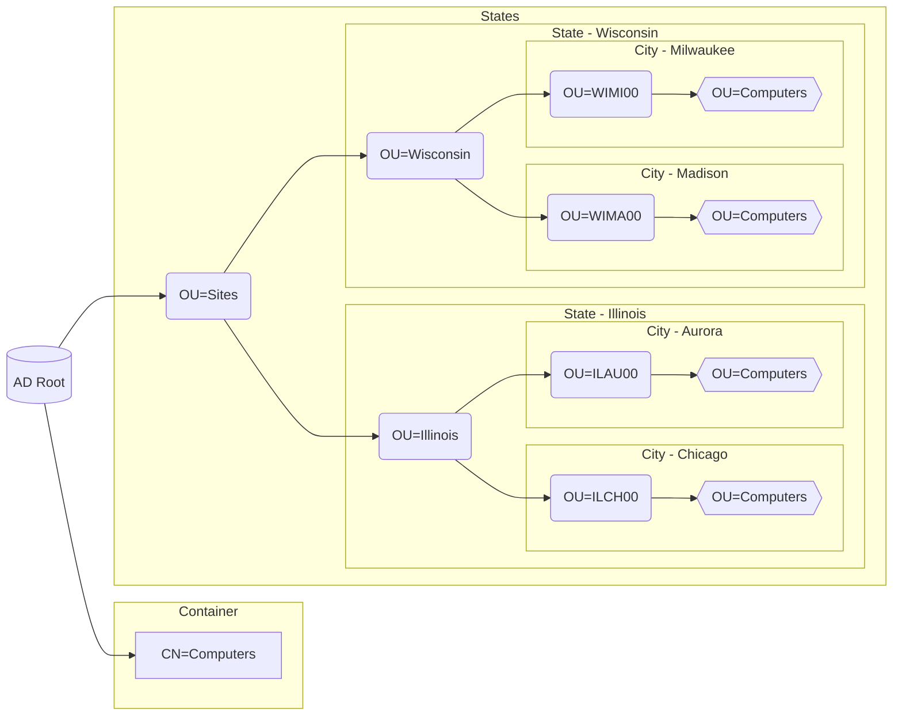

# About

[This script](Move-ComputersByStateSiteCode.ps1) organizes new AD computer objects into specific OU's based on US state abbrevations.

### Assumptions

Assumes the following of an AD infrastructure:
1. All newly created AD computer objects:
    1. are automatically created in the default "Computers" container.
    2. have a 6-character naming prefix, which starts with a two letter US state abbreviation.
    3. need to be placed under a custom "Sites" OU.
2. "Sites" is a root OU and uses the following example heirarchy:

