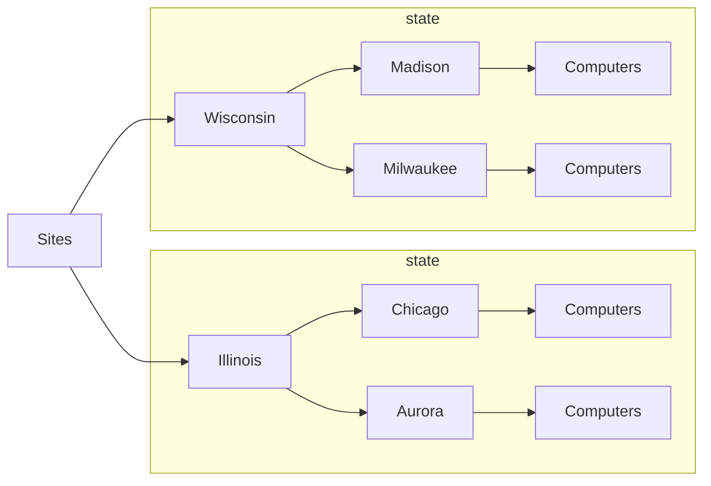

# About

This script can organize newly created AD computer objects into specific OU's based on state abbrevations.

### Assumptions

This script assumes the following of an AD infrastructure:
1. All newly created AD computer objects:
    1. are automatically placed in the default "Computers" container.
    2. need to be moved to a custom "Sites" OU.
2. "Sites" is a root OU and uses the following example heirarchy:
    - Sites
      - Illinois
        - Chicago
          - Computers
        - Aurora
          - Computers
      - Wisconsin
        - Madison
          - Computers
        - Milwaukee
          - Computers

