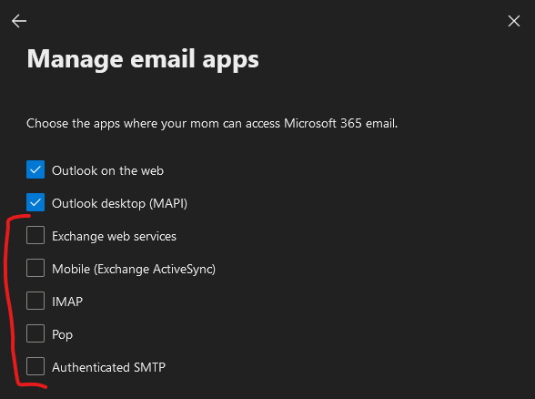
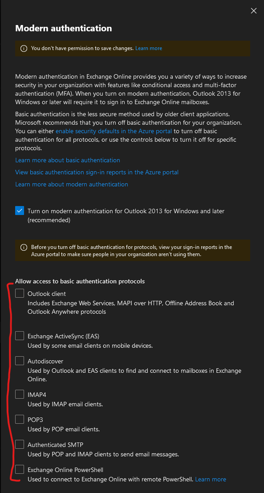

# About

This script disables **ALL** basic authentication protocols for every mailbox in your Microsoft 365 tenant.

Disabling these basic auth protocols will substantially improve your security posturing.

BE CAREFUL -- analyze Azure sign-in logs before taking any actions. If you find accounts using these, selectively enable protocls per-account and find a modern auth solution.

## Why?

Protocols like SMTP, POP, & IMAP do not authenticate with MFA, making them a popular attack vector.
Don't fall prey to an SMTP phishing hack after putting in the hardwork to deploy MFA.

Read more: https://learn.microsoft.com/en-us/exchange/clients-and-mobile-in-exchange-online/disable-basic-authentication-in-exchange-online

## Recommendations

### Disable protocols at the tenant level

#### Microsot 365
- note this ONLY applies to newly created accounts, not previous accounts.
- admin.microsoft.com > Settings > Org settings > Modern authentication > disable all basic authentication protocls

#### Exchange Online
- 

### Disable protocols via Azure CA
- could be considered overkill if disabling at the 365 account & tenant level, but hey what do I know.

### Enable modern authentication for Outlook in Exchange Online
- https://learn.microsoft.com/en-us/exchange/clients-and-mobile-in-exchange-online/enable-or-disable-modern-authentication-in-exchange-online
